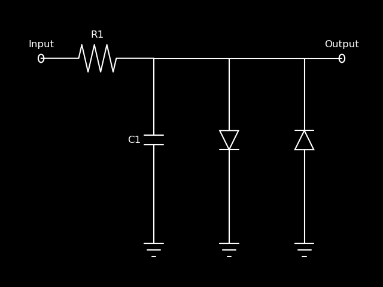

# Diode Clipper

RC diode clipper with anti-parallel diodes (and an optionally leaky capacitor)

Diode model based on Werner et al., ["An Improved and
Generalized Diode Clipper Model for Wave Digital Filters"](https://www.researchgate.net/publication/299514713_An_Improved_and_Generalized_Diode_Clipper_Model_for_Wave_Digital_Filters).

Lambert W function evaluated using D'Angelo et al.,
["Fast Approximation of the Lambert W Function for Virtual
Analog Modelling"](http://dafx.de/paper-archive/2019/DAFx2019_paper_5.pdf).
